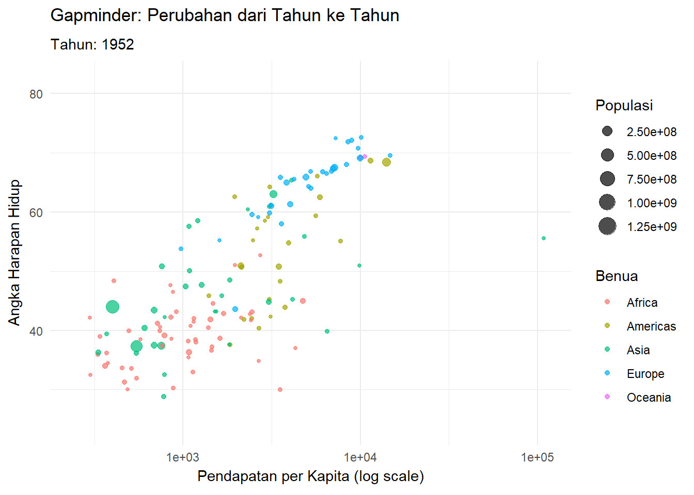

# Pendahuluan

Tugas UAS ini bertujuan untuk mengukur kemampuan dalam membuat visualisasi data yang informatif menggunakan R Markdown. Dataset yang digunakan berasal dari file `Data.xlsx`.

- **Nama**: Nanda ZHafran Mahendra
- **NIM**:  A3202300035
- **Tujuan Analisis**: Memberikan pemahaman visual dari data dengan berbagai jenis grafik.

## Struktur Folder

Proyek ini mengikuti struktur sebagai berikut:

```
project/
├── data/       
├── figures/  
├── docs/       
├── script/     
└── styles.css  
```

## Persiapan Data
```{r setup, include=FALSE}
library(readr)
library(readxl)
library(ggplot2)
library(plotly)
library(dplyr)
library(tidyverse)
library(gganimate)
library(gapminder)
library(htmlwidgets)

print(getwd())
print(file.exists("styles.css"))

# Membaca dataset
setwd("C:/Users/ACER/OneDrive/Documents/UAZ DATAVIZ")
data <- read_xlsx("data.xlsx")
print(data)

knitr::opts_chunk$set(echo = TRUE)

# Periksa nama kolom untuk memastikan
print(names(data))
summary(data)
print(names(data))

```

```{r}
# Validasi file dan membaca dataset
setwd("C:/Users/ACER/OneDrive/Documents/UAZ DATAVIZ")
if (!file.exists("data.xlsx")) {
  stop("File data.xlsx tidak ditemukan. Pastikan file berada di direktori yang benar.")
}

data <- read_xlsx("data.xlsx")

required_columns <- c("Pendapatan_per_kapita", "Angka_Harapan_Hidup")
if (!all(required_columns %in% names(data))) {
  stop("Beberapa kolom yang diperlukan tidak ditemukan di dataset.")
}
```

## Visualisasi Data

### 1. Grafik Univariat: Histogram

```{r}
print(names(data))

```
### a. Distribusi Angka Harapan Hidup
Grafik berikut menunjukkan distribusi angka harapan hidup dalam dataset. Histogram ini membantu kita memahami persebaran nilai, termasuk apakah data condong ke kanan, ke kiri, atau simetris.

```{r histogram}
# Histogram untuk variabel numerik
p1 <- ggplot(data, aes(x=Angka_Harapan_Hidup)) +  # Gunakan backticks jika ada spasi di nama kolom
  geom_histogram(binwidth = 5, fill = "skyblue", color = "black") +
  labs(title = "Distribusi Angka Harapan Hidup",
       x = "Angka_Harapan_Hidup",
       y = "Frekuensi") +
  theme_minimal()
if (!dir.exists("figures")) dir.create("figures")
ggsave("figures/scatterplot.png", p1)
print(p1)
```

### b. Distribusi Pendapatan per Kapita
Grafik berikut menunjukkan distribusi pendapatan per kapita. Grafik ini penting untuk melihat pola umum, seperti adanya outlier atau pola tertentu pada data.

```{r histogram2}
p2 <- ggplot(data, aes(x = Pendapatan_per_kapita)) +
  geom_histogram(binwidth = 2100, fill = "lightgreen", color = "black") +
  labs(title = "Distribusi Pendapatan per Kapita",
       x = "Pendapatan per Kapita",
       y = "Frekuensi") +
  theme_minimal()
ggsave("figures/histogram2.png", p2)
print(p2)
```

### 2. Grafik Bivariat: Scatter Plot
### a. Hubungan antara Pendapatan per Kapita dan Angka Harapan Hidup
Scatter plot berikut menunjukkan hubungan antara pendapatan per kapita dan angka harapan hidup. Grafik ini membantu melihat apakah ada pola hubungan linear, seperti semakin tinggi pendapatan, semakin tinggi angka harapan hidup.


```{r scatter}
p2 <- ggplot(data, aes(x = Angka_Harapan_Hidup, y = `Pendapatan_per_kapita`)) +
  geom_point(color = "darkred", alpha = 0.5) +
  labs(title = "Hubungan antara Pendapatan per Kapita dan Angka Harapan Hidup",
       x = "Angka_Harapan_Hidup",
       y = "Pendapatan_per_Kapita") +
  theme_minimal()

ggsave("figures/scatterplot2.png", p2)
print(p2)
```


### 3.A Grafik Multivariat: Bubble Plot
Populasi sebagai ukuran gelembung dan Benua sebagai kategori warna.
```{r bubbleplot}
p3 <- ggplot(data, aes(x = Angka_Harapan_Hidup, 
                       y = `Pendapatan_per_kapita`, 
                       size = Populasi, color = Benua)) +
  geom_point(alpha = 0.5) +
  scale_size(range = c(2, 12)) +
  labs(title = "Hubungan Multivariat Antar Variabel",
       x = "Angka Harapan Hidup",
       y = "Pendapatan per Kapita",
       size = "Populasi",
       color = "Benua") +
  theme_minimal()

ggsave("figures/bubbleplot.png", p3)
print(p3)
```

### 3.B Gravik Multifariat: Bubble Plot
```{r heatmap}
heatmap_data <- data %>%
  group_by(Benua, Tahun) %>%
  summarize(MeanLifeExpectancy = mean(`Angka_Harapan_Hidup`, na.rm = TRUE), .groups = 'drop')

p3 <- ggplot(heatmap_data, aes(x = Tahun, y = Benua, fill = MeanLifeExpectancy)) +
  geom_tile() +
  labs(title = "Heatmap Angka Harapan Hidup Rata-rata",
       x = "Tahun",
       y = "Benua",
       fill = "Rata-rata Harapan Hidup") +
  theme_minimal()

ggsave("figures/heatmap.png", p3)
print(p3)
```


### 4. Grafik Interaktif: Scatter Plot dengan Plotly
A. pembaca dapat mengeksplorasi hubungan antar variabel secara langsung dengan Grafik interaktif 3D
```{r interactive, results='asis'}
p4 <- plot_ly(data, x = ~`Pendapatan_per_kapita`, y = ~`Angka_Harapan_Hidup`, z = ~Populasi,
              type = "scatter3d", mode = "markers",
              marker = list(size = 5, color = ~Populasi, colorscale = "Viridis"))

p4
```

### 5. Grafik Dinamis: Gapminder Animation
perubahan indikator sosial-ekonomi global dari waktu ke waktu.
```{r gganimate}
p5 <- ggplot(gapminder, aes(x = gdpPercap, 
                            y = lifeExp, 
                            size = pop, 
                            color = continent)) +
  geom_point(alpha = 0.7) +
  scale_x_log10() +
  labs(title = "Gapminder: Perubahan dari Tahun ke Tahun",
       x = "Pendapatan per Kapita (log scale)",
       y = "Angka Harapan Hidup",
       size = "Populasi",
       color = "Benua") +
  theme_minimal() +
  gganimate::transition_states(year, transition_length = 2, state_length = 1) +
  gganimate::enter_fade() +
  gganimate::exit_fade() +
  labs(subtitle = "Tahun: {closest_state}")

anim <- gganimate::animate(p5, nframes = 100, renderer = gganimate::gifski_renderer())

gganimate::anim_save("gapminder_animation.gif", animation = anim)




```

#### b. Scatter Plot Dasar
```{r gapminder_plot}
p5 <- ggplot(gapminder, aes(x = gdpPercap, y = lifeExp, size = pop, color = continent)) +
  geom_point(alpha = 0.7) +
  scale_x_log10() +
  labs(title = "Hubungan GDP per Capita dan Life Expectancy",
       x = "GDP per Capita",
       y = "Life Expectancy") +
  theme_minimal()
print(p5)
```

#### c. Animasi Transisi Waktu
```{r gapminder_animate}
p6 <- p5 +
  transition_time(year) +
  labs(title = "Year: {frame_time}") +
  shadow_mark(alpha = 0.3, size = 0.5)

animate(p6, renderer = gifski_renderer())
```

## Kesimpulan

Berdasarkan analisis visual:

1. Angka harapan hidup menunjukkan distribusi yang beragam di berbagai negara.
2. Ada korelasi tertentu antara pendapatan per kapita dan angka harapan hidup.
3. Rata-rata angka harapan hidup berbeda berdasarkan benua dan tahun.
4. Visualisasi interaktif memberikan gambaran hubungan tiga variabel yang lebih mendalam.
5. Animasi membantu memahami perubahan pola data seiring waktu.


